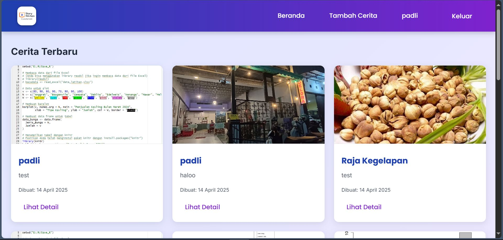
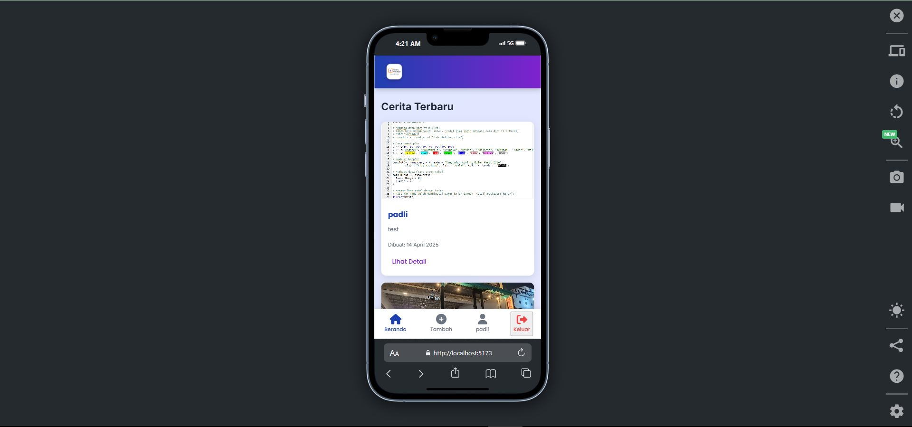

# 📖 Story App

  
  
  
  

Selamat datang di **Story App**, sebuah aplikasi web interaktif yang memungkinkan Anda untuk berbagi cerita, pengalaman, dan momen berharga dengan dilengkapi foto dan lokasi geografis. Story App dirancang untuk menjadi platform sederhana namun kuat bagi pengguna yang ingin mendokumentasikan perjalanan hidup mereka dan terhubung dengan komunitas. 🌍

---

## 🎯 Tentang Story App

Story App adalah aplikasi berbasis web yang memungkinkan pengguna untuk membuat, melihat, dan berbagi cerita dalam bentuk teks, gambar, dan lokasi pada peta. Aplikasi ini ideal untuk Anda yang suka berbagi pengalaman perjalanan, petualangan, atau sekadar momen sehari-hari dengan sentuhan personal. Dengan antarmuka yang responsif, Story App dapat digunakan dengan nyaman di perangkat desktop maupun mobile.

### **Kegunaan Story App**
- **Mendokumentasikan Momen:** Simpan cerita Anda dengan foto dan lokasi, sehingga Anda bisa mengenang momen tersebut kapan saja.
- **Berbagi dengan Komunitas:** Bagikan pengalaman Anda kepada pengguna lain dan lihat cerita dari orang-orang di seluruh dunia.
- **Eksplorasi Lokasi:** Gunakan peta interaktif untuk melihat lokasi cerita Anda dan orang lain, cocok untuk para pelancong yang ingin mencari inspirasi.
- **Akses Mudah:** Aplikasi ini responsif, sehingga Anda bisa menggunakannya di mana saja, baik dari laptop maupun smartphone.

---

## ✨ Fitur Utama

Story App hadir dengan fitur-fitur yang dirancang untuk memberikan pengalaman pengguna yang optimal:

### 1. **Berbagi Cerita dengan Foto dan Lokasi** 📸🌍
- Buat cerita dengan menambahkan judul, deskripsi, foto, dan lokasi geografis.
- Unggah foto langsung dari perangkat atau ambil gambar menggunakan kamera (di perangkat yang mendukung).
- Lokasi cerita ditampilkan pada peta interaktif, memungkinkan Anda untuk melihat di mana cerita tersebut dibuat.

### 2. **Peta Interaktif Berbasis MapTiler** 🗺️
- Integrasi dengan MapTiler untuk menampilkan peta dengan gaya "Streets" yang detail dan responsif.
- Tambahkan marker pada peta berdasarkan koordinat lokasi cerita (latitude dan longitude).
- Peta dapat di-zoom dan digeser untuk eksplorasi lokasi secara interaktif.

### 3. **Tampilan Daftar Cerita** 📜
- Lihat semua cerita dalam bentuk daftar yang rapi dengan layout grid responsif.
- Setiap cerita menampilkan thumbnail foto, judul, dan deskripsi singkat.
- Animasi halus saat cerita dimuat untuk pengalaman visual yang menyenangkan.

### 4. **Detail Cerita** 📝
- Klik cerita untuk melihat detail lengkap, termasuk foto besar, deskripsi, tanggal pembuatan, dan lokasi pada peta.
- Tombol "Kembali" yang sticky untuk navigasi yang lebih mudah di perangkat desktop.

### 5. **Autentikasi Pengguna** 🔒
- Fitur login dan register untuk mengamankan akun pengguna.
- Logout dengan mudah melalui tombol di navbar (desktop) atau bottom navbar (mobile).

### 6. **Antarmuka Responsif** 📱💻
- Desain yang sepenuhnya responsif, dioptimalkan untuk perangkat desktop, tablet, dan mobile.
- Bottom navbar di perangkat mobile untuk navigasi yang lebih intuitif, dengan ikon dan teks yang terpusat secara vertikal.
- Efek hover dan transisi halus untuk interaksi yang lebih menarik di desktop.

### 7. **Notifikasi Toast** 🔔
- Tampilan notifikasi berbasis toast untuk memberikan umpan balik kepada pengguna, seperti pesan sukses, error, atau peringatan.
- Contoh: "Cerita berhasil ditambahkan!" atau "Gagal memuat peta."

### 8. **Efek Animasi dan Transisi** 🌟
- Animasi fade-in untuk daftar cerita agar lebih menarik secara visual.
- Transisi halus saat navigasi antar halaman menggunakan View Transitions API (dengan fallback untuk browser yang tidak mendukung).
- Efek hover pada tombol dan elemen interaktif untuk pengalaman pengguna yang lebih baik.

---

## 🚀 Teknologi yang Digunakan

Story App dibangun dengan teknologi modern untuk memastikan performa dan pengalaman pengguna yang optimal:

- **HTML5:** Struktur semantik untuk aksesibilitas dan SEO yang lebih baik.
- **CSS3:** 
  - Flexbox dan Grid untuk layout responsif.
  - Animasi CSS untuk efek visual seperti fade-in dan transisi.
  - Media queries untuk desain yang responsif di berbagai ukuran layar.
- **JavaScript (ES6+):**
  - Modular JavaScript dengan pola MVP (Model-View-Presenter) untuk kode yang terstruktur.
  - Async/await untuk menangani permintaan API secara efisien.
  - DOM manipulation untuk interaksi dinamis.
- **MapTiler SDK:** Integrasi peta interaktif dengan gaya "MapTiler Streets" untuk menampilkan lokasi cerita.
- **FontAwesome:** Ikon vektor untuk elemen UI seperti tombol navigasi dan bottom navbar.
- **Google Fonts:** Font "Poppins" dan "Inter" untuk tipografi yang modern dan mudah dibaca.
- **View Transitions API:** Transisi halaman yang mulus (dengan fallback animasi CSS untuk browser yang tidak mendukung).

---

## 📸 Preview Aplikasi

### **Desktop View**


### **Mobile View**


---

## 🔧 Cara Menjalankan Aplikasi

1. **Clone Repository**  
   Clone repository ini ke komputer Anda:
   ```bash
   git clone <repository-url>

   npm install

   npm install leaflet axios maplibre-Gagal

   npm run dev